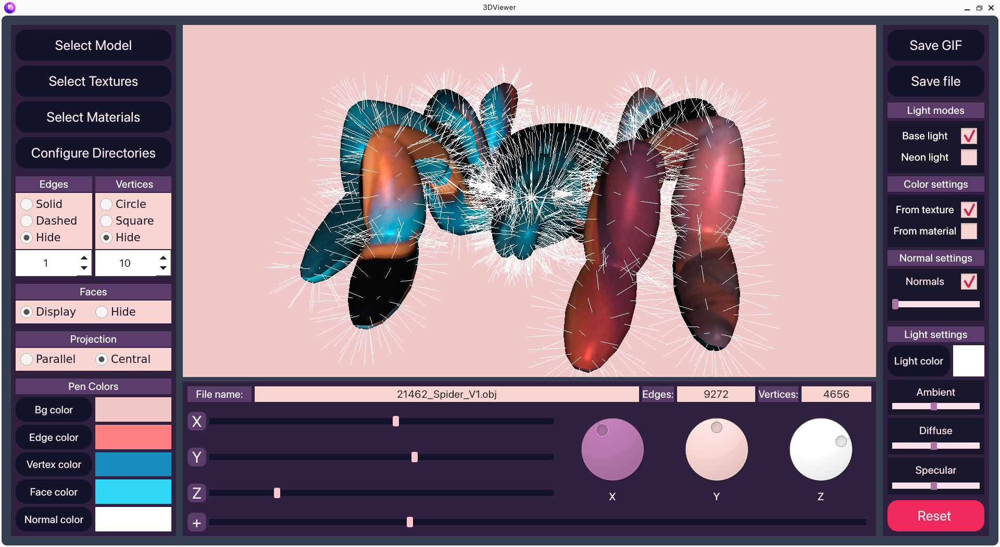

# 3DViewer-in-CPP

## Overview
Implementation of an application for viewing 3D wireframe models in C++ and performing various transformations and rendering operations on them.

  <h3 align=center>3D model with custom colors</h3>

  <h3 align=center>3D model with texture</h3>

  <h3 align=center>3D model with material</h3>

## Installation 
Run `make all` or `make install` to install the program.

## Usage
Run `make run` to launch the GUI-based application.

### Use files and directories

 

Via GUI you can: 
- load 3D models with OBJ files 
- load materials with MTL files
- load textures with image files
- save rendered model as image
- save rendered model as image
- configure default load and save directories

### Customize drawing settings

 

Via GUI you can customize:
- background color
- type, size and color of vertices
- type, size and color of edges
- visibility and color of faces
- type of projection
- visibility, size and color of normal vectors
- mode, color and intensity of light
- texture and material usage

### Perform model transformations
 

Via GUI you can: 
- translate model
- rotate model
- scale model

### Save settings
The settings are saved between program restarts.

### Additional information
The application can generate texture coordinates and vertex normals if that information is not present in OBJ file.

By default the program generates flat normals. In order to generate smooth normals you should modify file *3DViewer/sources/shared/consts.h* and set *default_smooth_normals* to *true*.

  <h4 align=center>Flat</h4>
  
    

  <h4 align=center>Smooth</h4>
  
  

  
## Dependencies
This program depends on the following libraries:
- Qt 6 (for GUI)
- GTest (for tests)
